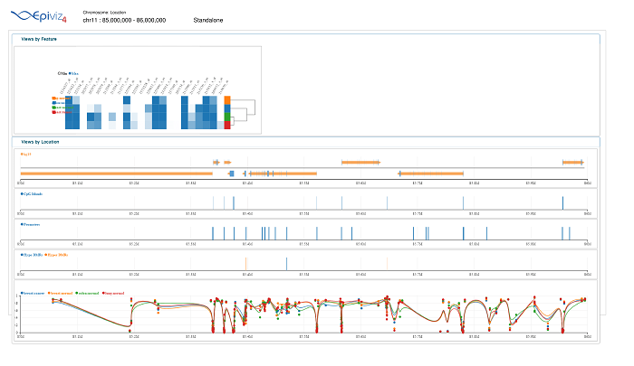
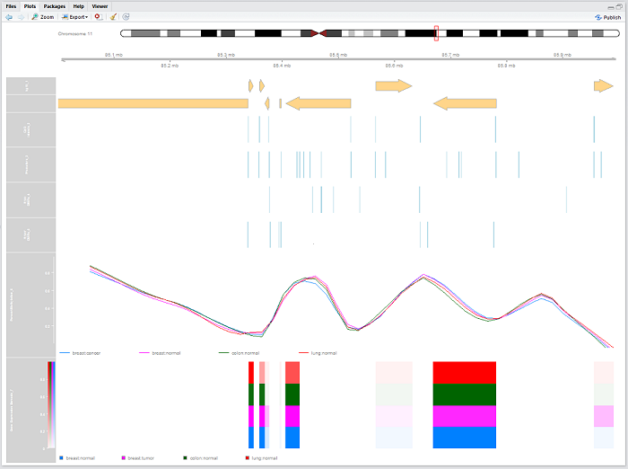
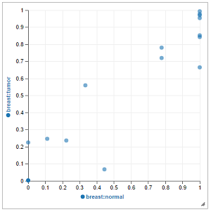
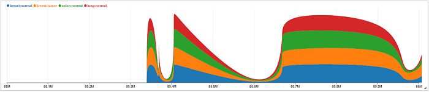
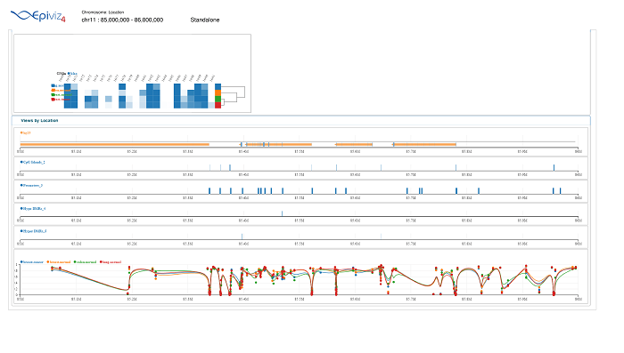
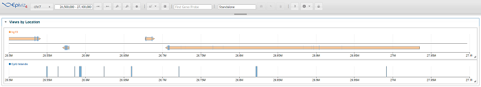

```{r setup, include=FALSE}
knitr::opts_chunk$set(fig.align='center')
```

## Getting started

The `epivizGvizConverter` package in R relies on the `epivizrStandalone` and `Gviz` packages available in Bioconductor. Its purpose is to reconstruct Epiviz workspaces created using the epivizr packages into plots formed by the Gviz package. In this vignette, we mimic the workspace created in the "Differentially Methylated Region Analysis" section from the `workshopBioc2016` and `bioc2016Addendum` packages. The data sets to be visualized include Gene Expression Barcode data, 450k Illumina Human Methylation data, and gene annotations to go along with them. 

Gather necessary R and Bioconductor packages and data to create Epiviz workspace.

```{r, eval=TRUE, message=FALSE, warning=FALSE}
# gather packages
library(devtools)
install_github("mlwalter4/epivizGvizConverter")
library(epivizGvizConverter)
```

```{r, eval=FALSE, message=FALSE, warning=FALSE}
# download other packages used in this vignette
source("https://bioconductor.org/biocLite.R")
biocLite(c("Homo.sapiens", "GenomicFeatures"))
library(Homo.sapiens)
library(GenomicFeatures)
```

```{r, eval=TRUE, message=FALSE}
# load datasets
data(promoter_regions, hyper_gr, hypo_gr, cpg_gr, bcode_eset, cgi_gr)
data(app, gviz_plot)
data(prom_track, scat_track, stac_track)
```

## Setting up the Epiviz workspace

Start the Epiviz application and create gene annotation, promoter, hypo- and hyper-differentially methylated regions, and percent methylation tracks.

For more assistance about how to create these types of workspaces, refer to the vignette for `epivizr`.

* http://bioconductor.org/packages/devel/bioc/vignettes/epivizr/inst/doc/IntroToEpivizr.html

```{r, eval=FALSE}
# create epiviz standalone workspace
app <- startStandalone(Homo.sapiens, keep_seqlevels=paste0("chr", c(10,11,20)), chr="chr11", try_ports=TRUE)

# add cpg islands as BlocksTrack
cgi_track <- app$plot(cgi_gr, datasource_name="CpG Islands")

# add promoters as a BlocksTrack
promoters_track <- app$plot(promoter_regions, datasource_name="Promoters")

# add hypo- and hyper-DMRs as datasources on epiviz
hypo_ds <- app$data_mgr$add_measurements(hypo_gr, "Hypo DMRs")
hyper_ds <- app$data_mgr$add_measurements(hyper_gr, "Hyper DMRs")

# add them to another BlocksTrack
measurements <- c(hypo_ds$get_measurements(), hyper_ds$get_measurements())
dmr_track <- app$chart_mgr$visualize("BlocksTrack", measurements = measurements)

# create LinesTrack for average methylation percentage
beta_track <- app$plot(cpg_gr,datasource_name="Percent Methylation",type="bp", settings=list(step=1, interpolation="basis"))

# add gene expression barcode datasource and HeatmapPlot
bcode_ms <- app$data_mgr$add_measurements(bcode_eset, "Gene Expression Barcode")
bcode_hmap <- app$chart_mgr$visualize("HeatmapPlot", datasource=bcode_ms)

# zoom in on workspace
app$navigate(chr="chr11", start=85000000, end=86000000)
```

By the end of the previous chunk of code and after printing the workspace to a pdf file, your Epiviz workspace should look like this:

```{r, eval=FALSE}
app$print_workspace(file_name="workspace", file_type="pdf")
```



## Working from an Epiviz workspace to Gviz plot

The main function in this package is`epivizToGviz` that converts an existing Epiviz workspace into a Gviz plot. While an Epiviz workspace allows you to interact with the genomic data by zooming and scrolling, it may be advantageous to transfer it to a familiar static visualization, like a set of plots from the Gviz Bioconductor package. In order to convert it to Gviz, the EpivizApp object must be actively connected by running the code above so that the chromosome number and start and end locations can be gathered from the interactive workspace. Of course, the EpivizApp object can also be created from other datasets sent to Epiviz from R other than the ones used here.

After the EpivizApp object is created, the following line will turn it into a Gviz plot automatically. As mentioned previously, the app argument must be an object of type "EpivizApp" from the `epivizr` Bioconductor package. The function gathers information about the Epiviz workspace, including the current chromosome, start, and end location of the viewing pane in Epiviz. It also preserves the same vertical order in which the Epiviz workspace was made.

The function will return the list of tracks that were successfully turned into Gviz plots. It will also automatically plot the new tracks once they are converted, unless the "plot_tracks" option is changed to FALSE. The Epiviz app must be connected and available for `epivizToGviz`to work properly.

```{r, eval=TRUE}
app
```

Convert to Gviz plot.

```{r, eval=FALSE}
gviz_plot <- epivizToGviz(app)
```



If the default Gviz settings are undesireable, you can always change them and update the overall plot. Here's an example of how the color of one of the AnnotationTracks may be changed and how to add a HighlightTrack to a region of interest. Use `displayPars()` to see other flexible visualization options.

```{r, eval=TRUE, fig.height=7, fig.width=7.5}
displayPars(gviz_plot[[4]]) <- list(fill="darkgreen")
ht <- HighlightTrack(gviz_plot[3:9], start=85660000, end=85800000, genome="hg19", chromosome="chr11")
plotTracks(c(gviz_plot[1:2],ht), from=85000000, to=86000000)
```

## More on the `epivizToGviz` function

There are separate functions within the `epivizToGviz` function that could be used separately to create tracks independently and only require granges objects as arguments. The table below describes each of their purposes.

Function                 | Epiviz Chart Object               | Gviz Track Object                                                       | Default Gviz Options
------------------------ | --------------------------------- | ----------------------------------------------------------------------- | -----------------------------------
convertEpivizBlocks      | BlocksTrack                       | AnnotationTrack                                                         | "dense" stacking and "box" shape 
convertEpivizGenes       | GenesTrack                        | IdeogramTrack, GenomeAxisTrack, GeneRegionTrack, BiomartGeneRegionTrack | "dense" stacking and "arrow" shape
convertEpivizLine        | LineTrack, LinePlot               | DataTrack                                                               | "smooth" plot type
convertEpivizStackedLine | StackedLineTrack, StackedLinePlot | DataTrack                                                               | "histogram" plot type
convertEpivizHeatmap     | HeatmapPlot                       | DataTrack                                                               | "heatmap" plot type
convertEpivizScatter     | ScatterPlot                       | DataTrack                                                               | "p" plot type

See the Gviz User Guide here for more detail about plot options:

* http://bioconductor.org/packages/devel/bioc/vignettes/Gviz/inst/doc/Gviz.pdf

The function also takes into account the optimal size for each track. For example, the IdeogramTracks and GenomeAxisTracks do not need to be as tall as a DataTrack where the axis needs to be clearly seen. If the track title does not show up on the left side of each panel, try increasing the size of the "Plots" pane in R so that there is enough room.

If you only have an EpivizChart object instead of a complete EpivizApp object, or wanted to use different components from multiple Epiviz workspaces, you could use one of these other functions to convert between the two visualization systems. Here, the promoters track (used in original workspace) is used as an example. The chromosome argument must be filled in to tell Gviz where to plot the data. 

```{r, eval=FALSE}
class(promoters_track)
prom_track <- convertEpivizBlocks(app=app, chart_obj=promoters_track, chr="chr11")
```

```{r, eval=TRUE, fig.height=3, fig.width=7}
plotTracks(c(GenomeAxisTrack(),prom_track), from=80000000, to=90000000)
class(prom_track)
```

Other chart types not used in the "Differentially Methylated Regions" workspace include ScatterPlots and StackedLineTracks. Here is an example of how a scatter plot is handled for the comparison of methylation data for breast tumor and normal breast samples.

```{r, eval=FALSE}
bcode_scat <- app$plot(bcode_eset, datasource_name="Gene Expression Barcode", columns=c("breast:normal","breast:tumor"))
scat_track <- convertEpivizScatter(app=app, chart_obj=bcode_scat, chr="chr11") 
```

```{r, eval=TRUE, fig.height=7, fig.width=7.5}
plotTracks(c(GenomeAxisTrack(),scat_track), from=85000000, to=86000000)
```



StackedLineTracks and StackedLinePlots may also by converted to their Gviz counterparts.

```{r, eval=FALSE}
bcode_stac <- app$chart_mgr$visualize("StackedLineTrack", datasource=bcode_ms)
stac_track <- convertEpivizStackedLine(app=app, chart_obj=bcode_stac, chr="chr11") 
```

```{r, eval=TRUE, fig.height=7, fig.width=7.5}
plotTracks(c(GenomeAxisTrack(),stac_track), from=85000000, to=86000000)
```



Close the connection to the Epiviz session.

```{r, eval=FALSE}
app$stop_app()
```

## Working from a Gviz plot to an Epiviz workspace

This package also contains the `gvizToEpiviz` function which takes in a Gviz plot object that is list of Gviz track class objects (e.g. GeneRegionTrack, AnnotationTrack, DataTrack). The following will open a connection to a new Epiviz session and workspace on the same plotting range as the provided Gviz plot. Because `gvizToEpiviz` runs on `epivizrStandalone`, you must provide the "annotation" argument with an OrganismDB object if the genome of the GeneRegionTrack is not set to "hg19" for the human genome or if there is no GeneRegionTrack in the Gviz plot itself. You can also specify the chromosome and start and end location manually if you want to view a different range than the original plot.

```{r, eval=TRUE}
gviz_plot
```

Convert to Epiviz workspace.

```{r, eval=FALSE}
app <- gvizToEpiviz(gviz_plot, start=85000000, end=86000000)
```

The workspace should end up looking like the one we began with in this vignette.



Once the Epiviz workspace is created, you can add other visualizations as you wish. The settings of the charts may also be altered. Here, we remove the LineTrack and replace it with a StackedLineTrack as an example, as well as change the color of the CpG island track.

```{r, eval=TRUE}
ls(envir=app$chart_mgr$.chart_list)
```

```{r, eval=FALSE}
app$chart_mgr$set_chart_settings("epivizChart_2", colors="#145a32")
app$chart_mgr$rm_chart("epivizChart_6")
displayPars(gviz_plot[[8]]) <- list(type="histogram")
convertGvizData(app=app, track=gviz_plot[[8]])
```


## Example from `The Gviz User Guide`

The `epivizGvizConverter` package can also serve as another interface to setup Epiviz workspaces along with `epivizr`.  Here is an example of how to do so based on an example from the `Gviz` user guide on page 5.

```{r, eval=TRUE, fig.height=2.7, fig.width=7}
library(Gviz)
library(GenomicRanges)
data(cpgIslands)
class(cpgIslands)
chr <- as.character(unique(seqnames(cpgIslands)))
gen <- genome(cpgIslands)
atrack <- AnnotationTrack(cpgIslands, name = "CpG")
gtrack <- GenomeAxisTrack()
itrack <- IdeogramTrack(genome = gen, chromosome = chr)
data(geneModels)
grtrack <- GeneRegionTrack(geneModels, genome = gen, chromosome = chr, name = "Gene Model")
plot <- plotTracks(list(itrack, gtrack, atrack, grtrack))
```

```{r, eval=FALSE}
app <- gvizToEpiviz(plot)
```

The following code would be an alternative method for producing this same visualization in Epiviz, however using the `epivizr` package functions instead of those found in this `epivizGvizConverter` package. Both versions give you the same result in Epiviz.

```{r, eval=FALSE}
data(cpgIslands)
app <- startStandalone(Homo.sapiens, keep_seqlevels="chr7", chr="chr7", port=7222)
app$navigate(chr="chr7", start=26500000, end=27100000)
cpg_islands_track <- app$plot(cpgIslands, datasource_name="CpG Islands")
```

The Epiviz workspace:



## More on the `gvizToEpiviz` function

There are three usable functions within `gvizToEpiviz`. They each convert an object that describes a Gviz track into their Epiviz chart matches.

Function              | Gviz Track Object                         | Gviz Plot Type        | Epiviz Chart Object 
--------------------- | ----------------------------------------- | --------------------- | ------------------- 
convertGvizGeneRegion | GeneRegionTrack, BiomartGeneRegionTrack   |                       | GenesTrack
convertGvizAnnotation | AnnotationTrack                           |                       | BlocksTrack
convertGvizData       | DataTrack                                 | "heatmap", "gradient" | HeatmapPlot
convertGvizData       | DataTrack                                 | "p"                   | ScatterPlot
convertGvizData       | DataTrack                                 | "histogram"           | StackedLineTrack
convertGvizData       | DataTrack                                 | all other plot        | LineTrack

Because there are many options for the "type" option when plotting using Gviz, any plot type that is not listed in the chart above and tracks that contain a grouping of plot types will automatically be plotted as a LineTrack visualization in Epiviz.

All of the Epiviz charts created through the `convertGvizData` function are also added as measurements to the workspace. This means you can add other interactive tracks and plots through using the "Visualizations" and "Computed Measurements" buttons. 

## SessionInfo

```{r session-info, cache=FALSE}
sessionInfo()
```
