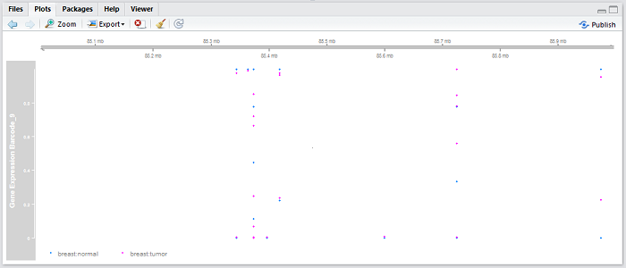
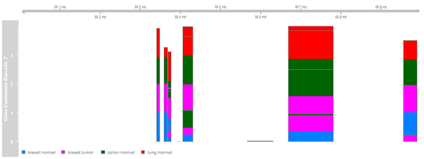

The `epivizGvizConverter` package in R relies on the `epivizrStandalone` and `Gviz` packages available in Bioconductor. Its purpose is to reconstruct Epiviz workspaces created using the epivizr packages into plots formed by the Gviz package. In this vignette, we mimic the workspace created in the "Differentially Methylated Region Analysis" section from the `workshopBioc2016` and `bioc2016Addendum` packages. The data sets to be visualized include Gene Expression Barcode data, 450k Illumina Human Methylation data, and gene annotations to go along with them. 

Gather necessary R and Bioconductor packages and data to create Epiviz workspace.

```{r, eval=F, message=F}
# gather packages
library(devtools)
install_github("mlwalter4/epivizGvizConverter")
library(epivizrStandalone)
library(Homo.sapiens)
library(GenomicFeatures)
library(TxDb.Hsapiens.UCSC.hg19.knownGene)

# load datasets
data(promoter_regions)
data(hyper_gr)
data(hypo_gr)
data(cpg_gr)
data(bcode_eset)
data(cgi_gr)
```

Start the Epiviz application and create gene annotation, promoter, hypo- and hyper-differentially methylated regions, and percent methylation tracks.

For more assistance about how to create these types of workspaces, refer to the vignette for `epivizr`.

* http://bioconductor.org/packages/devel/bioc/vignettes/epivizr/inst/doc/IntroToEpivizr.html

```{r, eval=F, message=F}
# create standalone workspace
app <- startStandalone(Homo.sapiens, keep_seqlevels=paste0("chr", c(10,11,20)), chr="chr11", port=7345)

# add cpg islands as BlocksTrack
cgi_track <- app$plot(cgi_gr, datasource_name="CpG Islands")

# add promoters as a BlocksTrack
promoters_track <- app$plot(promoter_regions, datasource_name="Promoters")

# add hypo- and hyper-DMRs as datasources on epiviz
hypo_ds <- app$data_mgr$add_measurements(hypo_gr, "Hypo DMRs")
hyper_ds <- app$data_mgr$add_measurements(hyper_gr, "Hyper DMRs")

# add them to another BlocksTrack
measurements <- c(hypo_ds$get_measurements(), hyper_ds$get_measurements())
dmr_track <- app$chart_mgr$visualize("BlocksTrack", measurements = measurements)

# create LinesTrack for average methylation percentage
beta_track <- app$plot(cpg_gr,datasource_name="Percent Methylation",type="bp", settings=list(step=1, interpolation="basis"))

# add gene expression barcode datasource and HeatmapPlot
bcode_ms <- app$data_mgr$add_measurements(bcode_eset, "Gene Expression Barcode")
bcode_hmap <- app$chart_mgr$visualize("HeatmapPlot", datasource=bcode_ms)

# zoom in on workspace
app$navigate(chr="chr11", start=85000000, end=86000000)
```

By the end of the previous chunk of code, your Epiviz workspace should look like this:


The main function in this package is`epivizToGviz` that converts an existing Epiviz workspace into a Gviz plot. While an Epiviz workspace allows you to interact with the genomic data by zooming and scrolling, it may be advantageous to transfer it to a familiar static visualization, like a plot from the Gviz Bioconductor package. In order to convert it to Gviz, the EpivizApp object must be actively connected by running the code above so that the chromosome number and start and end locations can be gathered from the interactive workspace. Of course, the EpivizApp object can also be created from other datasets sent to Epiviz from R other than the ones used here.

After the EpivizApp object is created, the following line will turn it into a Gviz plot automatically. As mentioned previously, the app argument must be an object of type "EpivizApp" from the `epivizr` Bioconductor package. The function gathers information about the Epiviz workspace, including the current chromosome, start, and end location of the viewing pane in Epiviz. It also preserves the same vertical order in which the Epiviz workspace was made.

```{r, eval=F, message=F}
epivizToGviz(app)
```

The Gviz plot should end up like this:


There are separate functions within the `epivizToGviz` function that could be used separately to create tracks independently and only require granges objects as arguments. The table below describes each of their purposes.

Function           | Epiviz Chart Object | Gviz Object                                     | Default Gviz Options
------------------ | ------------------- | ----------------------------------------------- | -----------------------------------
convertBlocks      | BlocksTrack         | AnnotationTrack                                 | "dense" stacking and "box" shape 
convertGenes       | GenesTrack          | IdeogramTrack, GenomeAxisTrack, GeneRegionTrack | "dense" stacking and "arrow" shape
convertLine        | LineTrack           | DataTrack                                       | "smooth" plot type
convertStackedLine | StackedLineTrack    | DataTrack                                       | "histogram" plot type
convertHeatmap     | HeatmapPlot         | DataTrack                                       | "heatmap" plot type
convertScatter     | ScatterPlot         | DataTrack                                       | "p" plot type

See the Gviz User Guide here for more detail about plot options:

* http://bioconductor.org/packages/devel/bioc/vignettes/Gviz/inst/doc/Gviz.pdf

The function also takes into account the optimal size for each track. For example, the IdeogramTracks and GenomeAxisTracks do not need to be as tall as a DataTrack where the axis needs to be clearly seen. If the track title does not show up on the left side of each panel, try increasing the size of the "Plots" pane in R so that there is enough room.

If you only have an EpivizChart object instead of a complete EpivizApp object, or wanted to use different components from multiple Epiviz workspaces, you could use one of these other functions to convert between the two visualization systems. Here, the promoters track (used in original workspace) is used as an example. The chromosome argument must be filled in to tell Gviz where to plot the data. 

```{r, eval=F, message=F}
class(promoters_track)
prom_track <- convertBlocks(app=app, chart_obj=promoters_track, chr="chr11")
plotTracks(c(GenomeAxisTrack(),prom_track), from=80000000, to=90000000)
class(prom_track)
```


Other chart types not used in the "Differentially Methylated Regions workspace" include ScatterPlots and StackedLineTracks. Here is an example of how a scatter plot is handled for the comparison of methylation data for breast tumor and normal breast samples.

```{r, eval=F, message=F}
bcode_scat <- app$plot(bcode_eset, datasource_name="Gene Expression Barcode", columns=c("breast:normal","breast:tumor"))
scat_track <- convertScatter(app=app, chart_obj=bcode_scat, chr="chr11") 
plotTracks(c(GenomeAxisTrack(),scat_track), from=85000000, to=86000000)
bcode_stac <- app$plot(bcode_eset, datasource_name="data", columns=c("breast:normal","breast:tumor"))
```




StackedLineTracks and StackedLinePlots may also by converted to their Gviz counterparts.

```{r, eval=F, message=F}
bcode_stac <- app$chart_mgr$visualize("StackedLineTrack", datasource=bcode_ms)
stac_track <- convertStackedLine(app=app, chart_obj=bcode_stac, chr="chr11") 
plotTracks(c(GenomeAxisTrack(),stac_track), from=85000000, to=86000000)
```



