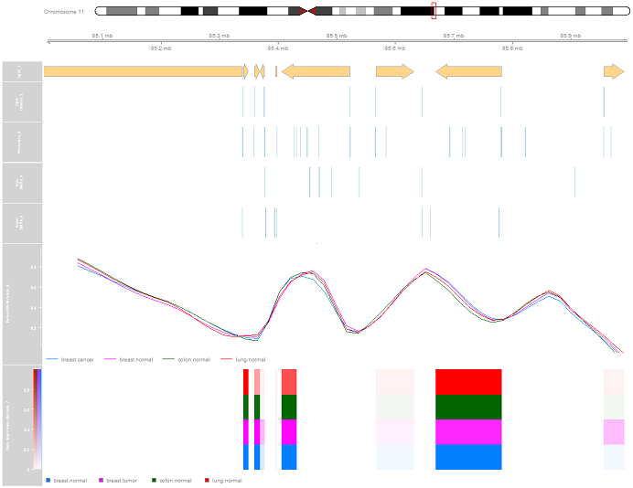

The `epivizGvizConverter` package in R relies on the `epivizrStandalone` and `Gviz` packages available in Bioconductor. Its purpose is to reconstruct Epiviz workspaces created using the epivizr packages into plots formed by the Gviz package. In this vignette, we download data from the `workshopBioc2016` package. The data sets to be visualized include Gene Expression Barcode data, 450k Illumina Human Methylation data, and gene annotations to go along with them. 

Gather necessary R and Bioconductor packages and data to create Epiviz workspace.

```{r, eval=F, message=F}
# gather packages
library(workshopBioc2016)
library(epivizrStandalone)
library(Homo.sapiens)
library(GenomicFeatures)
library(TxDb.Hsapiens.UCSC.hg19.knownGene)

# gather datasets
data(meth_set)
data(gm_set)
data(gratio_set)
```

Start the Epiviz application and create gene annotation, promoter, hypo- and hyper-differentially methylated regions, and percent methylation tracks.

```{r, eval=F, message=F}
app <- startStandalone(Homo.sapiens, keep_seqlevels=paste0("chr", c(10,11,20)), chr="chr11", port=7350)
promoter_regions <- promoters(TxDb.Hsapiens.UCSC.hg19.knownGene, upstream=1000, downstream=200)
promoters_track <- app$plot(promoter_regions, datasource_name="Promoters")

# first subset to breast samples
gratio_set_breast <- gratio_set[,which(gratio_set$Tissue=="breast")]

# make a design matrix to use with bumphunter
status <- pData(gratio_set_breast)$Status
mod <- model.matrix(~status)

# cluster cpgs into regions holding potential dmrs
gr <- granges(gratio_set_breast)
chr <- as.factor(seqnames(gr))
pos <- start(gr)
cl <- clusterMaker(chr, pos, maxGap=500)

# find dmrs
bumps <- bumphunter(gratio_set_breast, mod, cluster=cl, cutoff=0.1, B=0)

# categorize dmrs by type
dmr_gr <- with(bumps$table, GRanges(chr, IRanges(start,end), area=area, value=value))
dmr_gr$type <- ifelse(abs(dmr_gr$value) < 0.1, "neither",
                      ifelse(dmr_gr$value<0, "hypo", "hyper"))
table(dmr_gr$type)

# make a GRanges object for each dmr type
hyper_gr <- dmr_gr[dmr_gr$type == "hyper"]
hypo_gr <- dmr_gr[dmr_gr$type == "hypo"]

# add each of these as a datasource on epiviz
hypo_ds <- app$data_mgr$add_measurements(hypo_gr, "Hypo DMRs")
hyper_ds <- app$data_mgr$add_measurements(hyper_gr, "Hyper DMRs")

# add the track
measurements <- c(hypo_ds$get_measurements(), hyper_ds$get_measurements())
dmr_track <- app$chart_mgr$visualize("BlocksTrack", measurements = measurements)

betas <- getBeta(gratio_set)
pd <- pData(gratio_set)
fac <- paste(pd$Tissue, pd$Status, sep=":")
sample_indices <- split(seq(len=nrow(pd)), fac)

mean_betas <- sapply(sample_indices, function(ind) rowMeans(betas[,ind]))

cpg_gr <- granges(gm_set)
mcols(cpg_gr) <- mean_betas
beta_track <- app$plot(cpg_gr,datasource_name="Percent Methylation",type="bp", settings=list(step=1, interpolation="basis"))
```

By the end of the previous chunk of code, your Epiviz workspace should look like this:


While an Epiviz workspace allows you to interact with the genomic data by zooming and scrolling, it may be advantageous to transfer it to a static visualization, like a plot from the Gviz Bioconductor package. In order to get the EpivizApp object that holds the workspace information, you can either run the code above or download it from this package.

```{r, eval=F, message=F}
data(app)
```

The `epivizToGviz` function converts an existing Epiviz workspace into a Gviz plot. Since the EpivizApp object is already created, the following will turn it into a Gviz plot automatically. The function gathers information about the Epiviz workspace, including the current chromosome, start, and end location of the viewing pane in Epiviz. It also preserves the same vertical order in which the Epiviz workspace was made.

```{r, eval=F, message=F}
epivizToGviz(app)
```

The Gviz plot should end up like this:



There are separate functions within the `epivizToGviz` function that could be used separately to create tracks independently and only require granges objects as arguments. The table below describes each of their purposes.

Function                | Epiviz Chart Object | Gviz Object           
----------------------- | ------------------- | -----------------------------------------------
convertBlocksTrack      | BlocksTrack         | AnnotationTrack
convertGenesTrack       | GenesTrack          | IdeogramTrack, GenomeAxisTrack, GeneRegionTrack
convertLineTrack        | LineTrack           | DataTrack
convertStackedLineTrack | StackedLineTrack    | DataTrack

Some notes about these functions:

* `convertBlocksTrack` uses the "dense" stacking and "box" shape option for AnnotationTracks
* `convertGenesTrack` uses the "dense" stacking and "arrow" shape option for GeneRegionTracks
* `convertLineTrack` uses the Gviz "smooth" plot type for DataTracks
* `convertStackedLineTrack` uses the Gviz "mountain" plot type for DataTracks

See the Gviz User Guide here:
http://bioconductor.org/packages/devel/bioc/vignettes/Gviz/inst/doc/Gviz.pdf

The function also takes into account the optimal size for each track. For example, the IdeogramTracks and GenomeAxisTracks do not need to be as tall as a DataTrack where the axis needs to be clearly seen.

If you only have an EpivizChart object instead of a complete EpivizApp object, or wanted to use different components from multiple Epiviz workspaces, you could use one of these other functions to convert between the two systems. Here, the promoters track (used in original workspace) is used as an example. The chromosome argument must be filled in to tell Gviz where to plot the data. 

```{r, eval=F, message=F}
class(promoters_track)
track <- convertBlocksTrack(chart=promoters_track, chr="chr11")
plotTracks(track, from=80000000, to=90000000)
class(track)
```


As of now, there is no support for other Epiviz chart types not listed above such as HeatmapPlots, LinePlots, ScatterPlots, and StackedLinePlots, so these tracks would not be plotted through Gviz. 

